-----

# Projeto Onboarding: Cronograma de Desenvolvimento

**Meta:** Criar uma plataforma onde o Frontend renderiza formulários dinamicamente baseados em regras do Backend (JSON).

-----
## Jornada do Usuário
### Candidato

```mermaid

graph LR
    %% Estilos (Cores da imagem enviada)
    classDef startend fill:#b9f6ca,stroke:#00c853,stroke-width:2px,color:#000,rx:10,ry:10;
    classDef process fill:#fff9c4,stroke:#fbc02d,stroke-width:2px,color:#000;

    %% Nós do Fluxo do Candidato
    Start(Início: Recebe Email) --> Step1[Acessa Link Único]
    Step1 --> Step2[Visualiza Fases do Processo]
    Step2 --> Step3[Preenche Dados Cadastrais]
    Step3 --> Step4[Realiza Upload de Documentos]
    Step4 --> Step5[Revisa Informações]
    Step5 --> Step6[Clica em 'Enviar para Análise']
    Step6 --> End(Fim: Aguarda Aprovação)

    %% Aplicando as cores
    class Start,End startend;
    class Step1,Step2,Step3,Step4,Step5,Step6 process;

```

### RH
```mermaid

graph LR
    %% Estilos
    classDef startend fill:#b9f6ca,stroke:#00c853,stroke-width:2px,color:#000,rx:10,ry:10;
    classDef process fill:#fff9c4,stroke:#fbc02d,stroke-width:2px,color:#000;
    classDef decision fill:#fff9c4,stroke:#fbc02d,stroke-width:4px,color:#000; 

    %% Nós do Fluxo do RH
    Start(Início: Login Admin) --> Step1[Acessa Dashboard de Gestão]
    Step1 --> Step2[Visualiza Lista de Candidatos]
    Step2 --> Step3[Clica em 'Ver Detalhes']
    Step3 --> Step4[Confere Respostas e Arquivos]
    Step4 --> Step5{Aprova ou Reprova?}
    
    %% Caminhos da Decisão
    Step5 -- Se Reprovar --> Step6[Insere Motivo da Reprovação]
    Step6 --> Step7[Devolve Fase para Candidato]
    
    Step5 -- Se Aprovar --> Step8[Avança para Fase 'Setup TI']
    Step8 --> End(Fim: Processo Concluído)

    %% Aplicando as cores
    class Start,End startend;
    class Step1,Step2,Step3,Step4,Step6,Step7,Step8 process;
    class Step5 decision;

````
-----

## Modelagem de Dados (MER)

A inteligência do sistema reside no banco de dados. Abaixo, a estrutura relacional planejada para suportar formulários dinâmicos:


