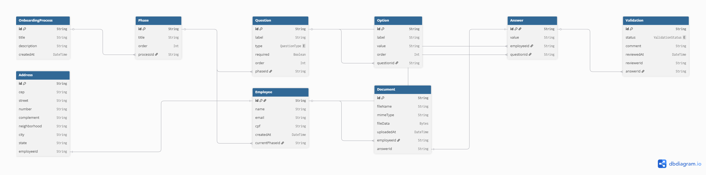

-----

# Projeto Onboarding: Cronograma de Desenvolvimento

**Meta:** Criar uma plataforma onde o Frontend renderiza formulários dinamicamente baseados em regras do Backend (JSON).

-----
## Jornada do Usuário

```mermaid

graph RL
    %% Estilos (Cores da imagem enviada)
    classDef startend fill:#b9f6ca,stroke:#00c853,stroke-width:2px,color:#000,rx:10,ry:10;
    classDef process fill:#fff9c4,stroke:#fbc02d,stroke-width:2px,color:#000;

    %% Nós do Fluxo do Candidato
    Start(Início: Recebe Email) --> Step1[Acessa Link Único]
    Step1 --> Step2[Visualiza Fases do Processo]
    Step2 --> Step3[Preenche Dados Cadastrais]
    Step3 --> Step4[Realiza Upload de Documentos]
    Step4 --> Step5[Revisa Informações]
    Step5 --> Step6[Clica em 'Enviar para Análise']
    Step6 --> End(Fim: Aguarda Aprovação)

    %% Aplicando as cores
    class Start,End startend;
    class Step1,Step2,Step3,Step4,Step5,Step6 process;

```




-----

## Semana 1: O "Esqueleto" Funcional (08/12 - 12/12)

**Objetivo:** Até sexta-feira, um candidato consegue salvar dados e arquivos no banco.

### Segunda-feira (08/12): Fundação & Banco de Dados

**Foco:** Modelagem DB (Prisma) + Migrations.

  - [x] Configurar ambiente Node.js e TypeScript.
  - [x] Instalar PostgreSQL e configurar `.env`.
  - [x] Criar Schema do Prisma (`schema.prisma`).
  - [x] Rodar Migration Inicial (`npx prisma migrate dev`).
  - [x] Criar e Rodar Seed Database (`npx prisma db seed`).

**Entregável:** Banco de dados rodando com as tabelas `OnboardingProcess`, `Phase`, `Question` populadas.

```typescript
// Espaço para anotações do Schema final (prisma/schema.prisma)
model Question {
  id      String @id @default(uuid())
  label   String
  type    QuestionType // TEXT, FILE, SELECT...
  // ...
}
```

## Modelagem de Dados (MER)

A inteligência do sistema reside no banco de dados. Abaixo, a estrutura relacional planejada para suportar formulários dinâmicos:



-----

### Terça-feira (09/12): Dados Básicos (API & Renderização)

**Foco:** Conexão Front-Back e renderização dinâmica.

  - [X] **Backend:** Criar Rota `GET /process/:id/phases` (Retorna o JSON da estrutura).
  - [X] **Backend:** Criar Rota `POST /employee` (Cria o candidato inicial).
  - [X] **Frontend:** Configurar Axios e React Query.
  - [X] **Frontend:** Criar componente `DynamicInput` (Switch case que renderiza Input ou Select).

**Entregável:** Tela inicial que "desenha" os inputs baseados no que vem do banco.

```typescript
// Exemplo de estrutura do JSON esperado da API
// GET /process/default/phases
[
  {
    "title": "Dados Pessoais",
    "questions": [
       { "label": "Nome", "type": "TEXT" },
       { "label": "Gênero", "type": "SELECT", "options": [...] }
    ]
  }
]
```

-----

### Quarta-feira (10/12): Uploads (A Parte Crítica)

**Foco:** Configurar Multer e Input de Arquivos

  - [ ] **Backend:** Configurar Middleware Multer.
  - [ ] **Backend:** Criar Rota `POST /upload` (Salva na pasta `/uploads` e retorna URL).
  - [ ] **Frontend:** Criar componente `InputFile`.
  - [ ] **Integração:** Ao selecionar arquivo, o Front faz upload e salva a URL no campo `value` da resposta.

**Entregável:** Candidato consegue enviar "Foto do RG" e o arquivo aparece na pasta do servidor.

```typescript
// Configuração básica do Multer (backend/src/config/upload.ts)
import multer from 'multer';
// Cole sua configuração aqui...
```

-----

### Quinta-feira (11/12): Motor de Regras

**Foco:** Lógica de Transição de Fases.

  - [ ] **Backend:** Criar Rota `POST /next-step`.
  - [ ] **Backend:** Validar campos obrigatórios (`required: true`) antes de permitir avanço.
  - [ ] **Frontend:** Integração com *React Hook Form* para impedir envio vazio.
  - [ ] **Lógica:** Se sucesso -\> Atualiza `currentPhaseId` do colaborador.

**Entregável:** O sistema bloqueia o usuário se ele tentar pular etapa sem preencher tudo.

```typescript
// Lógica de validação (Pseudo-código)
if (question.required && !answer.value) {
   throw new Error("Campo obrigatório não preenchido");
}
```

-----

### Sexta-feira (12/12): Deploy Alpha (VPS)

**Foco:** Configurar ambiente de produção.

  - [ ] Contratar/Configurar VPS (OVH/DigitalOcean).
  - [ ] Instalar Docker ou Node/Postgres/Nginx manualmente na VPS.
  - [ ] Configurar **Nginx** como Proxy Reverso (Porta 80 -\> 3000/Backend e 80 -\> Estáticos/Frontend).
  - [ ] Rodar Build do React (`npm run build`).

**Entregável:** Link acessível publicamente onde é possível cadastrar um usuário.

```nginx
# Espaço para configuração do Nginx (/etc/nginx/sites-available/default)
server {
    server_name seu-dominio.com;
    
    location /api {
        proxy_pass http://localhost:3000;
    }
}
```

-----

## Semana 2: Interface de Gestão e Entrega (15/12 - 19/12)

**Objetivo:** Interface do RH e Polimento final.

### Segunda-feira (15/12): Admin View

**Foco:** Listagem de Candidatos.

  - [ ] **Backend:** Rota `GET /admin/employees` (Retorna lista com fase atual).
  - [ ] **Frontend:** Criar Dashboard do RH (Tabela simples).

### Terça-feira (16/12): Detalhes & Aprovação

**Foco:** Visualizar respostas e arquivos.

  - [ ] **Frontend:** Tela de Detalhes (Clicar no nome -\> Ver respostas).
  - [ ] **Backend:** Rotas de Ação (`POST /approve`, `POST /reject`).
  - [ ] **Frontend:** Botões de Aprovar (Avança fase) ou Reprovar (Volta fase/Comentário).

### Quarta-feira (17/12): Segurança

**Foco:** Proteger a área administrativa.

  - [ ] Implementar Login simples (Hardcoded ou tabela `AdminUser`).
  - [ ] Middleware de proteção nas rotas `/admin`.

### Quinta-feira (18/12): Polimento

**Foco:** UX e UI.

  - [ ] Adicionar Loadings (Skeleton screens).
  - [ ] Toasts de Sucesso/Erro (ex: "Salvo com sucesso").
  - [ ] Melhorar CSS (Tailwind) dos formulários.

### Sexta-feira (19/12): Entrega Final

**Foco:** Testes e Documentação.

  - [ ] Teste Ponta a Ponta (Do cadastro à aprovação).
  - [ ] Escrever README.md com instruções de como rodar.
  - [ ] Gravar vídeo de Demo ou preparar apresentação.

-----
